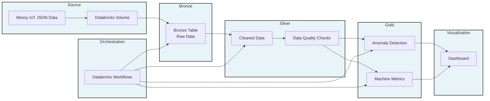
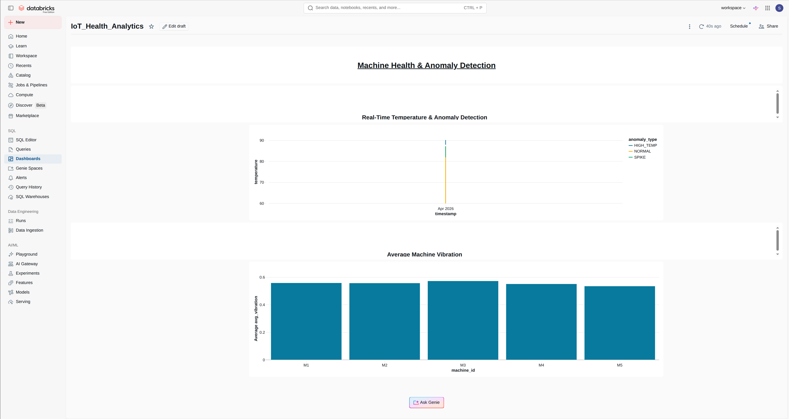
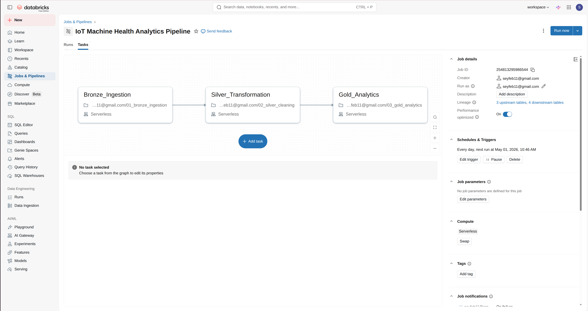
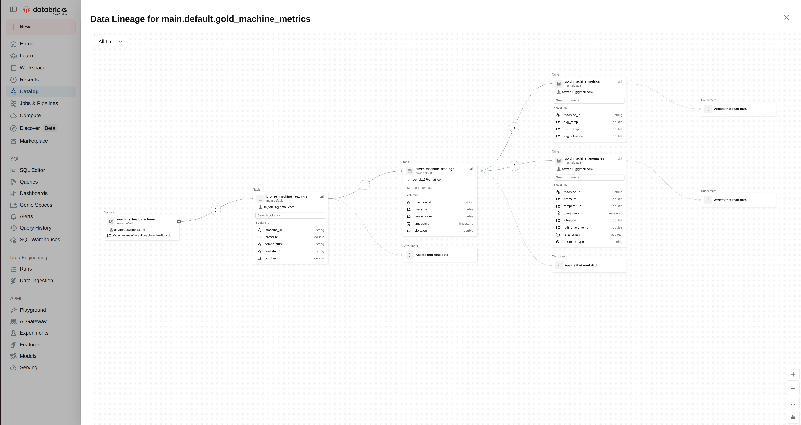
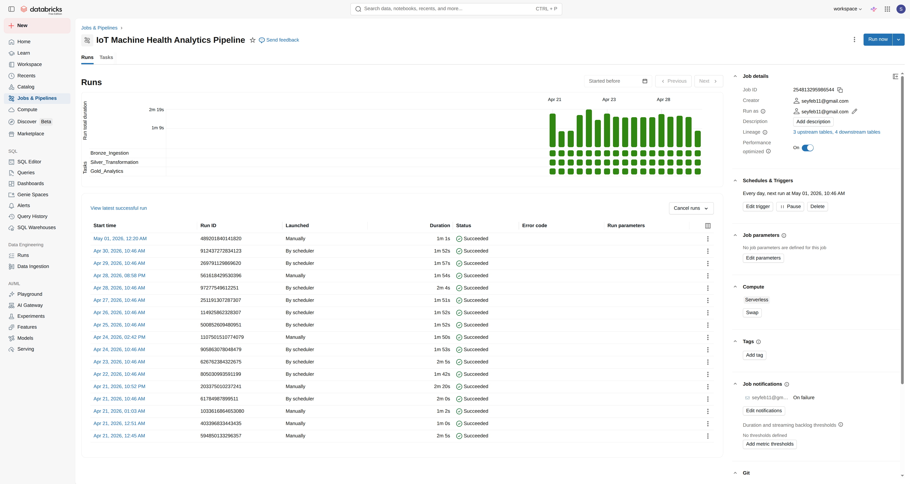

# Machine Health Monitoring Pipeline (Databricks | Medallion Architecture)

This project demonstrates an end-to-end data engineering pipeline for IoT machine health monitoring using Databricks and a Medallion Architecture (Bronze, Silver, Gold).

The pipeline ingests messy sensor data, performs cleaning and validation, detects anomalies using time-series logic, and produces analytics-ready datasets with a dashboard for monitoring.

---

## Architecture Diagram


## Project Screenshots

### Dashboard


### Task Graph


### Lineage Graph


### Workflows


---

## Tech Stack

- Databricks (Delta Lake, Workflows, Dashboard)
- PySpark
- SQL
- Delta Tables
- Unity Catalog (Volumes)

---

## Features

- End-to-end Medallion Architecture (Bronze → Silver → Gold)
- Ingestion of messy IoT JSON data
- Data cleaning and transformation using PySpark
- Data quality checks (nulls, ranges, duplicates)
- Time-series anomaly detection using window functions
- Aggregated machine performance metrics
- Workflow orchestration using Databricks Workflows
- Interactive dashboard for monitoring anomalies

---

## Project Structure

---

```
machine-health-monitoring-databricks/
├── notebooks/
│   ├── 01_bronze_ingestion
│   ├── 02_silver_cleaning
│   ├── 03_gold_analytics
│   └── 04_dashboard
├── data/
│   └── sample_iot_data.json
├── images/
│   └── *.png
└── README.md
```

---


## How the Pipeline Works

### 1. Data Ingestion (Bronze)

- Raw IoT sensor data is stored in a Databricks Volume
- Data is ingested without transformation
- Schema is flexible to preserve raw inconsistencies

---

### 2. Data Cleaning (Silver)

- Remove inconsistent formats 
- Cast columns to correct types
- Handle missing values
- Remove outliers
- Deduplicate records

---

### 3. Data Quality Checks

- Null value validation
- Range checks (temperature, vibration)
- Duplicate detection
- Optional pipeline failure on bad data

---

### 4. Analytics Layer (Gold)

#### Anomaly Detection

- Rolling average using window functions

- Detect:
  - HIGH_TEMP → temperature ≥ threshold
  - SPIKE → deviation from rolling average

#### Machine Metrics

- Average temperature
- Maximum temperature

---

### 5. Orchestration

- Implemented using Databricks Workflows

- Task dependencies:
  - Bronze → Silver → Gold

- Scheduled execution

---

### 6. Dashboard

- Visualizes:
  - Anomalies over time
  - Machine performance

---

## Example Outputs

### Anomalies Table

| machine_id | timestamp           | temperature | anomaly_type |
|------------|--------------------|-------------|--------------|
| M1         | 2026-03-29 01:11   | 120         | HIGH_TEMP    |

---

### Machine Metrics

| machine_id | avg_temp | max_temp | avg_vibration |
|------------|----------|----------|---------------|
| M1         | 78.5     | 120      | 0.65          |

---

## Insights

- Certain machines show recurring high-temperature anomalies, indicating potential overheating issues
- Sudden temperature spikes suggest unstable machine behavior
- Machines with higher vibration tend to produce more anomalies
- Anomalies often occur in bursts rather than uniformly over time

---

## Key Learnings

- Designing Medallion Architecture pipelines
- Handling messy real-world data
- Implementing data quality checks
- Using window functions for time-series analytics
- Building production-style pipelines in Databricks
- Orchestrating workflows with dependencies

---

## Author

Seyfemichael Araya  
Berlin, Germany  
LinkedIn: https://www.linkedin.com/in/seyfemichael-araya-a82290288/
